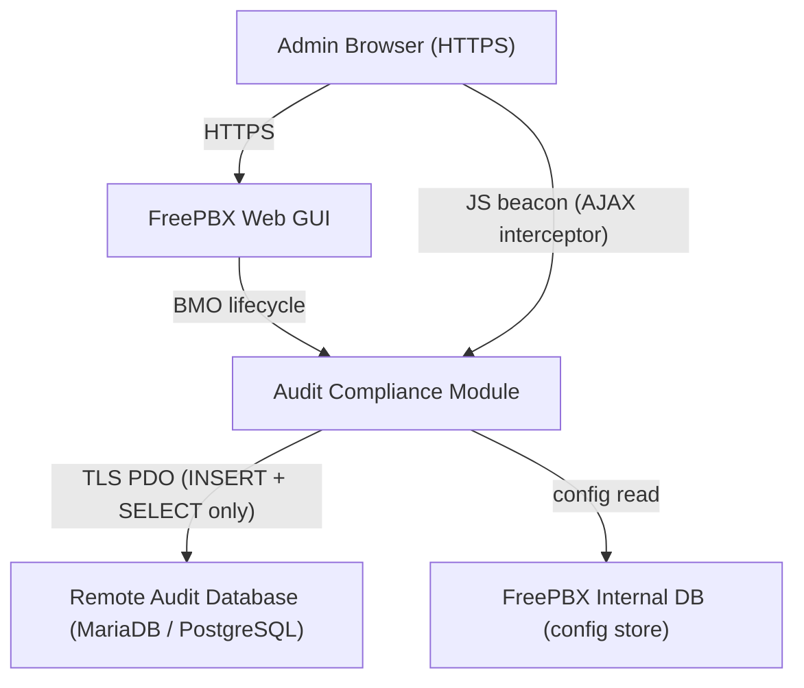
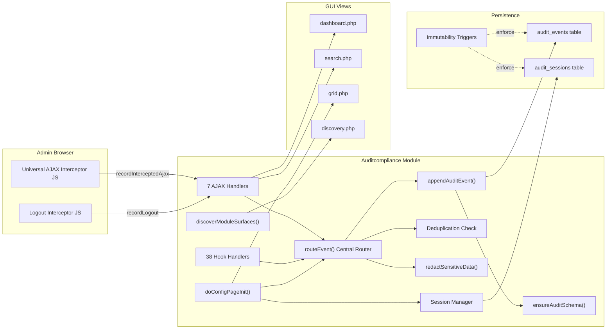
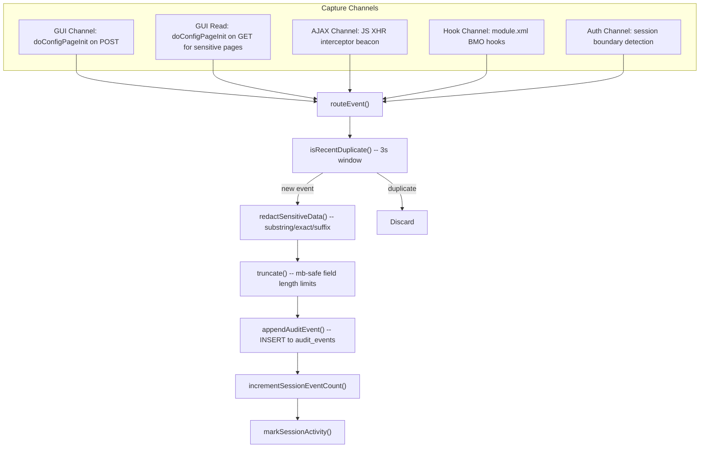
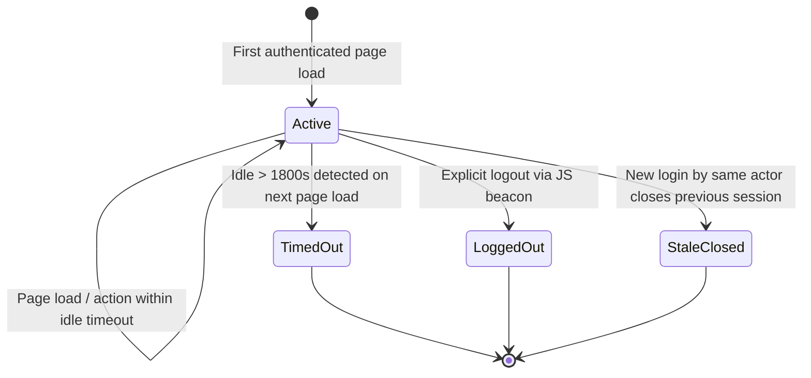
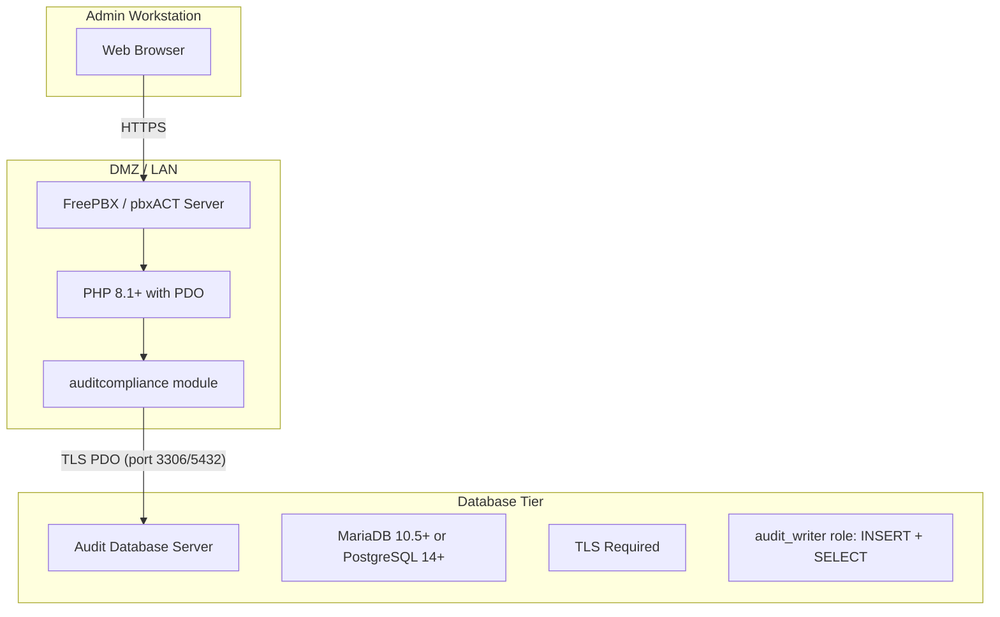

# Architecture Overview

| Field    | Value                            |
|----------|----------------------------------|
| Module   | auditcompliance v17.0.0-alpha    |
| Date     | 20-02-2026                       |
| Status   | Draft                            |
| Audience | Developers, Architects           |

---

## 1. System Context

The audit module operates within the FreePBX Web GUI. It observes administrator actions through
multiple capture channels and persists immutable event records to a dedicated audit database.

### Trust Boundaries

| Boundary | Protocol | Controls |
|----------|----------|----------|
| Browser to FreePBX | HTTPS | FreePBX session management, CSRF tokens |
| FreePBX to Audit DB | TLS PDO | Dedicated least-privilege role (INSERT + SELECT only) |
| Admin to Audit Data | GUI RBAC | `checkSection('auditcompliance')` on page + AJAX |

---

## 2. Component Diagram

---

## 3. Multi-Channel Event Capture Pipeline

All channels converge at `routeEvent()`, ensuring uniform normalization, deduplication,
redaction, and persistence regardless of the event source.

---

## 4. Session Lifecycle

| Transition | Trigger | Mechanism |
|------------|---------|-----------|
| `[*] -> Active` | Admin logs in, first page load detected by `ensureSessionState()` | New `audit_sessions` row, login event recorded |
| `Active -> Active` | Any page load within idle timeout | `SESSION_KEY_LAST_ACTIVITY` updated |
| `Active -> TimedOut` | `(now - last_activity) > idle_timeout` on next page load | Timeout event recorded, session closed, new session opened |
| `Active -> LoggedOut` | Admin clicks logout link | JS interceptor fires `recordLogout` AJAX, session closed |
| `Active -> StaleClosed` | Same actor logs in again while old session is still active | `closeStaleActiveSessions()` closes previous sessions |

---

## 5. Deployment Topology

### Network Requirements

| Source | Destination | Port | Protocol | Purpose |
|--------|-------------|------|----------|---------|
| Admin browser | FreePBX server | 443 | HTTPS | Web GUI access |
| FreePBX server | Audit DB server | 3306 or 5432 | TCP + TLS | Audit event persistence |

---

## 6. Technology Stack

| Layer | Technology | Version |
|-------|-----------|---------|
| Platform | FreePBX / pbxACT | 17.x (Framework >= 17.0.1) |
| Runtime | PHP | 7.4+ (8.1+ recommended) |
| Database driver | PDO | `pdo_mysql` and/or `pdo_pgsql` |
| Audit DB | MariaDB or PostgreSQL | 10.5+ / 14+ |
| Transport security | TLS | Required for remote audit DB |
| Client-side | Vanilla JavaScript | ES5 compatible (no dependencies) |
| CSS | Vanilla CSS | Scoped with `audit-` prefix |

---

## 7. Key Design Decisions

| Decision | Rationale |
|----------|-----------|
| **Module-only approach (no core patches)** | Zero risk of breaking FreePBX upgrades; module can be installed/removed independently |
| **Universal AJAX interceptor via JS** | Captures all AJAX calls for any module without per-module adapters; closes the largest coverage gap identified in upstream analysis |
| **Append-only with DB triggers** | Immutability enforced at the database layer, not just the application layer; protects against application-level bypasses |
| **Separate audit database** | Separation of concerns; audit data survives PBX rebuilds; different retention and backup policies |
| **Session-grouped events** | Provides compliance-ready "who did what when" narrative rather than disconnected event logs |
| **Three-tier redaction (substring/exact/suffix)** | Balances thoroughness (catches `sip_password`, `vm_pass`) with precision (avoids false positives on `cert_id`, `pinsets_id`) |
| **Deduplication window (3 seconds)** | Prevents duplicate events from multi-channel capture (e.g., GUI POST triggers both `doConfigPageInit` and a BMO hook) without losing genuinely repeated actions |
| **PHP `time()` for timestamps** | Server clock authority; UTC + local (Europe/Chisinau) stored for every event |
