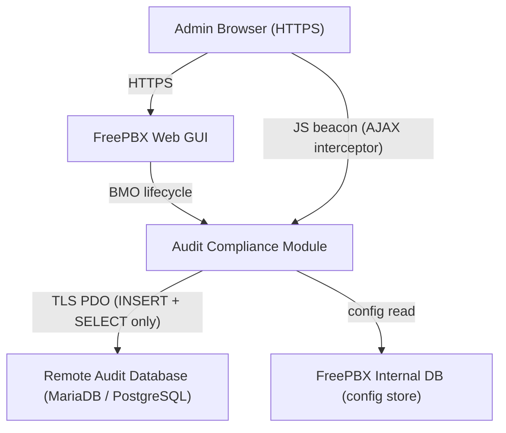
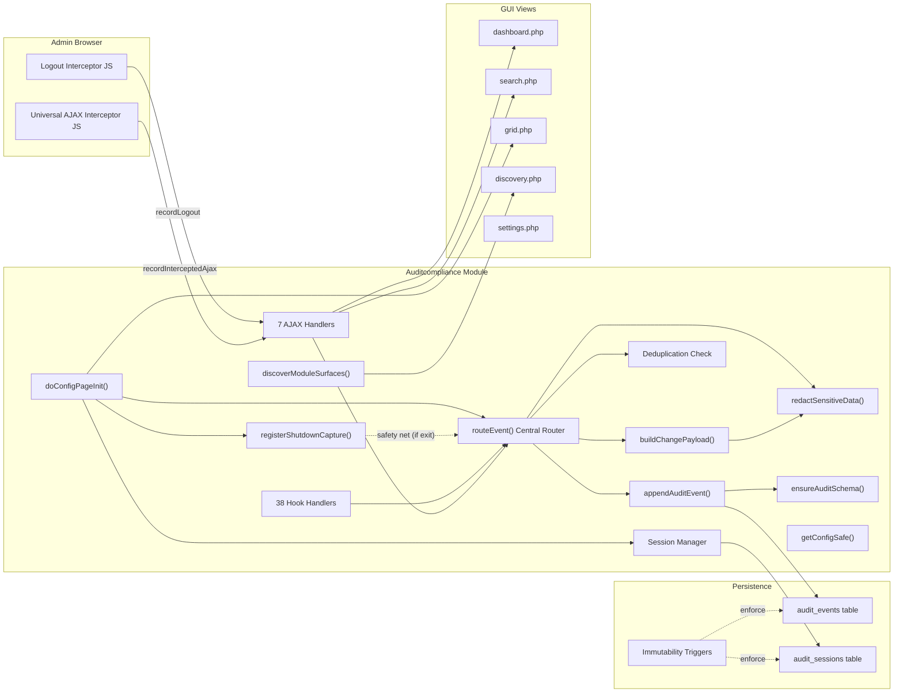
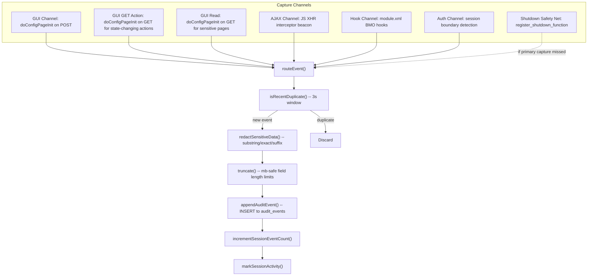
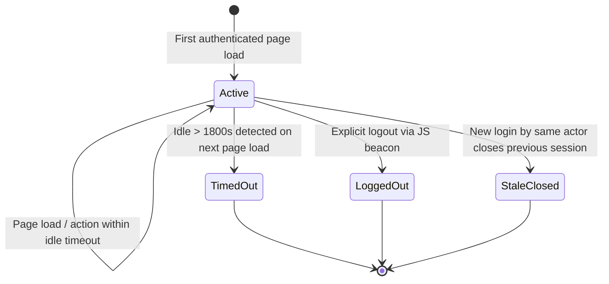
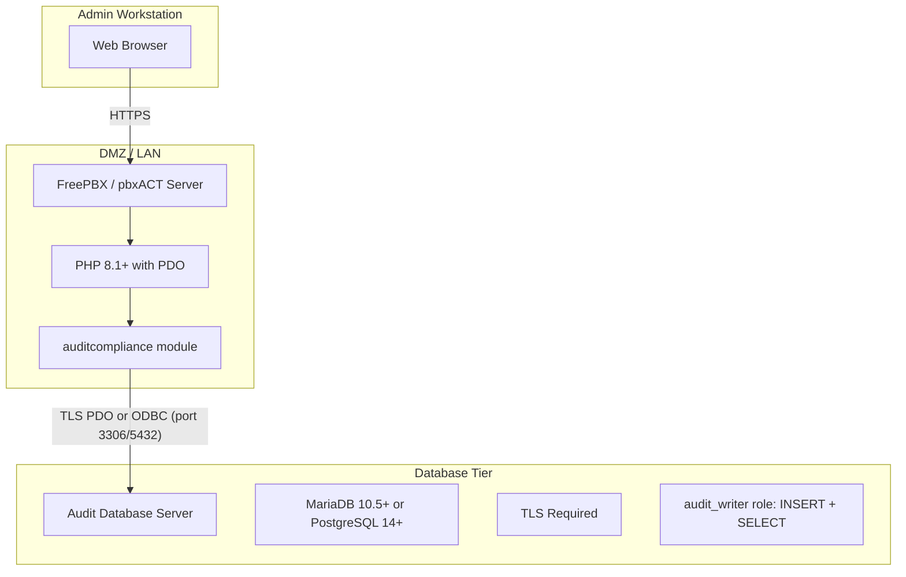

# Architecture Overview

| Field    | Value                            |
|----------|----------------------------------|
| Module   | auditcompliance v17.0.0-beta1   |
| Date     | 25-02-2026                       |
| Status   | Beta                             |
| Audience | Developers, Architects           |

---

## 1. System Context

The audit module operates within the FreePBX Web GUI. It observes administrator actions through
multiple capture channels and persists immutable event records to a dedicated audit database.

### Trust Boundaries

| Boundary | Protocol | Controls |
|----------|----------|----------|
| Browser to FreePBX | HTTPS | FreePBX session management, CSRF tokens |
| FreePBX to Audit DB | TLS PDO | Dedicated least-privilege role (INSERT + SELECT only) |
| Admin to Audit Data | GUI RBAC | `checkSection('auditcompliance')` on page + AJAX |

---

## 2. Component Diagram

---

## 3. Multi-Channel Event Capture Pipeline

All channels converge at `routeEvent()`, ensuring uniform normalization, deduplication,
redaction, and persistence regardless of the event source.

---

## 4. Session Lifecycle

| Transition | Trigger | Mechanism |
|------------|---------|-----------|
| `[*] -> Active` | Admin logs in, first page load detected by `ensureSessionState()` | New `audit_sessions` row, login event recorded |
| `Active -> Active` | Any page load within idle timeout | `SESSION_KEY_LAST_ACTIVITY` updated |
| `Active -> TimedOut` | `(now - last_activity) > idle_timeout` on next page load | Timeout event recorded, session closed, new session opened |
| `Active -> LoggedOut` | Admin clicks logout link | JS interceptor fires `recordLogout` AJAX, session closed |
| `Active -> StaleClosed` | Same actor logs in again while old session is still active | `closeStaleActiveSessions()` closes previous sessions |

---

## 5. Deployment Topology

### Network Requirements

| Source | Destination | Port | Protocol | Purpose |
|--------|-------------|------|----------|---------|
| Admin browser | FreePBX server | 443 | HTTPS | Web GUI access |
| FreePBX server | Audit DB server | 3306 or 5432 | TCP + TLS | Audit event persistence |

---

## 6. Technology Stack

| Layer | Technology | Version |
|-------|-----------|---------|
| Platform | FreePBX / pbxACT | 17.x (Framework >= 17.0.1) |
| Runtime | PHP | 7.4+ (8.1+ recommended) |
| Database driver | PDO | `pdo_mysql`, `pdo_pgsql`, or `pdo_odbc` |
| ODBC (optional) | unixODBC | System ODBC layer with MariaDB/PostgreSQL driver |
| Audit DB | MariaDB or PostgreSQL | 10.5+ / 14+ |
| Transport security | TLS | Required for remote audit DB (native PDO or ODBC driver-level) |
| Client-side | Vanilla JavaScript | ES5 compatible (no dependencies) |
| CSS | Vanilla CSS | Scoped with `audit-` prefix |

---

## 7. Key Design Decisions

| Decision | Rationale |
|----------|-----------|
| **Module-only approach (no core patches)** | Zero risk of breaking FreePBX upgrades; module can be installed/removed independently |
| **Universal AJAX interceptor via JS** | Captures all AJAX calls for any module without per-module adapters; closes the largest coverage gap identified in upstream analysis |
| **Append-only with DB triggers** | Immutability enforced at the database layer, not just the application layer; protects against application-level bypasses |
| **Separate audit database** | Separation of concerns; audit data survives PBX rebuilds; different retention and backup policies |
| **Session-grouped events** | Provides compliance-ready "who did what when" narrative rather than disconnected event logs |
| **Three-tier redaction (substring/exact/suffix)** | Balances thoroughness (catches `sip_password`, `vm_pass`) with precision (avoids false positives on `cert_id`, `pinsets_id`) |
| **Deduplication window (3 seconds)** | Prevents duplicate events from multi-channel capture (e.g., GUI POST triggers both `doConfigPageInit` and a BMO hook) without losing genuinely repeated actions |
| **PHP `time()` for timestamps** | Server clock authority; UTC + local (Europe/Chisinau) stored for every event |
| **ODBC support via pdo_odbc** | Enterprises that mandate centralized ODBC data sources or need driver-level TLS management can connect without native PDO drivers; backend engine auto-detected or explicitly configured |
| **Inline LIMIT/OFFSET** | Pagination values are sanitized via `max()/min()` casts and inlined into SQL strings instead of using PDO bound parameters, preventing `SQLSTATE[42000]` syntax errors on MySQL with `ATTR_EMULATE_PREPARES = true` (default PHP < 8.1) |
| **Explicit LIKE ESCAPE clause** | All `LIKE` queries specify `ESCAPE '\'` for correct wildcard escaping on PostgreSQL where `standard_conforming_strings = on` (default since 9.1) removes the implicit backslash escape |
| **Resilient config retrieval** | `getConfigSafe()` wraps FreePBX `getConfig()` to handle `null`, `false`, and empty string returns consistently, preventing silent TLS disablement when config store returns `false` for unset keys |
| **Shutdown capture safety net** | `register_shutdown_function` fires even after `exit()` or `redirect_standard()`, catching events from modules (Trunks, Misc Destinations) that terminate early before the main capture logic runs |
| **GET-based action capture** | FreePBX's action bar triggers deletes via GET redirects (`location.href = delLink`); the module now detects state-changing actions on GET requests using `STATE_CHANGING_PREFIXES` matching |
| **Self-referential change baseline** | Instead of reading the live FreePBX DB (unreliable due to hook execution order), the module stores each event's POST data and uses it as the baseline for subsequent diffs; eliminates dependency on module-specific API methods |
| **Semantic value normalization** | Comparing before/after states uses intelligent normalization (`areBothFalsy`, `normalizeListValue`) to suppress false-positive diffs from format differences (e.g., `"0"` vs `""`, newline vs hyphen separators) |
| **Hook noise suppression** | Hooks that fire as internal sub-operations (e.g. `addUser`, `addDevice` during extension creation) are suppressed during `config.php` GUI requests where `doConfigPageInit` already captures the primary event. During `ajax.php` requests, only the first hook per PHP request is recorded. Cross-channel AJAX dedup prevents the JS interceptor beacon from duplicating events already captured by hooks. |
| **Create/update action distinction** | POST events with generic actions (`update`, `save`, `submit`) that have no prior audit baseline are automatically labeled `create`, clearly distinguishing entity creation from edits. Module-specific action names (e.g., `addgrp`, `addtrunk`) are preserved as-is. |
| **Session-based entity name cache** | A data-driven `ENTITY_CACHE_MAP` defines ID→name resolution for 9 modules (Userman, IVR, Time Conditions, Announcements, Trunks, Contact Manager, Certman, Backup, Calendar). The cache is populated on non-state-changing GET page views and consumed by `resolveObjectId()` for GET delete and AJAX delete events, converting opaque numeric/UUID IDs to human-readable names. POST events use raw IDs to preserve baseline consistency. |
