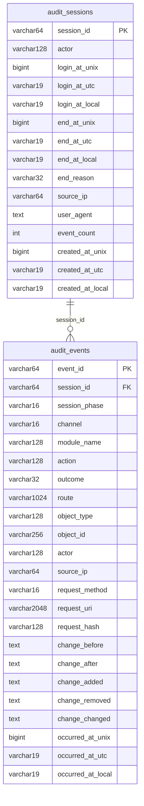

# Database Schema Reference

| Field    | Value                            |
|----------|----------------------------------|
| Module   | auditcompliance v17.0.0-alpha    |
| Date     | 20-02-2026                       |
| Status   | Draft                            |
| Audience | Developers, DBAs, Operations     |

---

## Entity-Relationship Diagram



---

## Table: `audit_sessions`

Stores one row per admin login session. Updated during the session lifecycle (event count
increment, session close) but never deleted (protected by trigger).

| Column | Type | Null | Default | Description |
|--------|------|------|---------|-------------|
| `session_id` | VARCHAR(64) | No | -- | Primary key. Format: `sess_` + 32 hex chars from `random_bytes(16)` |
| `actor` | VARCHAR(128) | No | -- | Admin username from `$_SESSION['AMP_user']->username` |
| `login_at_unix` | BIGINT | No | -- | Unix timestamp of session start |
| `login_at_utc` | VARCHAR(19) | No | -- | UTC timestamp: `DD-MM-YYYY HH:MM:SS` |
| `login_at_local` | VARCHAR(19) | No | -- | Europe/Chisinau timestamp: `DD-MM-YYYY HH:MM:SS` |
| `end_at_unix` | BIGINT | Yes | NULL | Unix timestamp of session end |
| `end_at_utc` | VARCHAR(19) | Yes | NULL | UTC timestamp of session end |
| `end_at_local` | VARCHAR(19) | Yes | NULL | Local timestamp of session end |
| `end_reason` | VARCHAR(32) | No | `'active'` | Session state: `active`, `logout`, `timeout` |
| `source_ip` | VARCHAR(64) | Yes | NULL | Client IP from `$_SERVER['REMOTE_ADDR']` |
| `user_agent` | TEXT | Yes | NULL | Browser user agent string (truncated to 1024 chars) |
| `event_count` | INT | No | 0 | Number of events recorded in this session |
| `created_at_unix` | BIGINT | No | -- | Row creation unix timestamp |
| `created_at_utc` | VARCHAR(19) | No | -- | Row creation UTC timestamp |
| `created_at_local` | VARCHAR(19) | No | -- | Row creation local timestamp |

### Mutability Rules

- **INSERT**: Allowed (new sessions)
- **UPDATE**: Allowed (session close, event count increment)
- **DELETE**: Blocked by trigger `trg_audit_sessions_no_delete`

---

## Table: `audit_events`

Stores one row per audit event. Fully immutable after insertion.

| Column | Type (PostgreSQL) | Type (MySQL) | Null | Description |
|--------|-------------------|--------------|------|-------------|
| `event_id` | VARCHAR(64) | VARCHAR(64) | No | Primary key. Format: `evt_` + 32 hex chars |
| `session_id` | VARCHAR(64) | VARCHAR(64) | No | FK to `audit_sessions.session_id` (logical, not enforced) |
| `session_phase` | VARCHAR(16) | VARCHAR(16) | No | `login`, `activity`, `logout`, `timeout`, `failure` |
| `channel` | VARCHAR(16) | VARCHAR(16) | No | `gui`, `ajax`, `hook`, `auth`, `rest` |
| `module_name` | VARCHAR(128) | VARCHAR(128) | No | Source module name |
| `action` | VARCHAR(128) | VARCHAR(128) | No | Normalized action name |
| `outcome` | VARCHAR(32) | VARCHAR(32) | No | `success` or `failure` |
| `route` | VARCHAR(1024) | VARCHAR(1024) | No | Display name or `module::method` |
| `object_type` | VARCHAR(128) | VARCHAR(128) | No | Entity type (typically lowercase module name) |
| `object_id` | VARCHAR(256) | VARCHAR(256) | No | Entity identifier (extension, user ID, etc.) |
| `actor` | VARCHAR(128) | VARCHAR(128) | No | Admin username or `unknown` |
| `source_ip` | VARCHAR(64) | VARCHAR(64) | No | Client IP address |
| `request_method` | VARCHAR(16) | VARCHAR(16) | No | HTTP method or `HOOK` |
| `request_uri` | VARCHAR(2048) | VARCHAR(2048) | No | Request URI |
| `request_hash` | VARCHAR(128) | VARCHAR(128) | No | SHA-256 of redacted request payload |
| `change_before` | TEXT | LONGTEXT | Yes | JSON: state before change |
| `change_after` | TEXT | LONGTEXT | Yes | JSON: state after change |
| `change_added` | TEXT | LONGTEXT | Yes | JSON: added fields |
| `change_removed` | TEXT | LONGTEXT | Yes | JSON: removed fields |
| `change_changed` | TEXT | LONGTEXT | Yes | JSON: changed fields (redacted) |
| `occurred_at_unix` | BIGINT | BIGINT | No | Unix timestamp of event occurrence |
| `occurred_at_utc` | VARCHAR(19) | VARCHAR(19) | No | UTC timestamp |
| `occurred_at_local` | VARCHAR(19) | VARCHAR(19) | No | Europe/Chisinau timestamp |

### Mutability Rules

- **INSERT**: Allowed
- **UPDATE**: Blocked by trigger `trg_audit_events_no_update`
- **DELETE**: Blocked by trigger `trg_audit_events_no_delete`

### Cross-Database Differences

| Feature | MariaDB/MySQL | PostgreSQL |
|---------|---------------|------------|
| `change_*` column type | LONGTEXT | TEXT |
| Integer type | INT | INTEGER |
| Index creation | `safeExec()` with duplicate detection | `CREATE INDEX IF NOT EXISTS` |
| Trigger syntax | `SIGNAL SQLSTATE '45000'` | `RAISE EXCEPTION` via PL/pgSQL function |

---

## Indexes

| Index Name | Table | Columns | Purpose |
|-----------|-------|---------|---------|
| `idx_audit_events_session_id` | audit_events | `session_id` | Session timeline queries |
| `idx_audit_events_occurred_at_unix` | audit_events | `occurred_at_unix` | Chronological sorting and date range filters |
| `idx_audit_events_actor` | audit_events | `actor` | Actor filter queries |
| `idx_audit_events_module_name` | audit_events | `module_name` | Module filter queries |
| `idx_audit_events_session_phase` | audit_events | `session_phase` | Phase filter and auth failure queries |
| `idx_audit_events_channel` | audit_events | `channel` | Channel filter queries |
| `idx_audit_events_dedup` | audit_events | `session_id, module_name, action, object_id, occurred_at_unix` | Cross-channel deduplication lookups |
| `idx_audit_sessions_login_at_unix` | audit_sessions | `login_at_unix` | Timeline ordering |
| `idx_audit_sessions_actor_end` | audit_sessions | `actor, end_reason` | Stale session cleanup queries |

---

## Immutability Triggers

### PostgreSQL

```sql
CREATE OR REPLACE FUNCTION audit_deny_modifications() RETURNS trigger AS $$
BEGIN
    RAISE EXCEPTION 'Audit tables are append-only';
END;
$$ LANGUAGE plpgsql;

CREATE TRIGGER trg_audit_events_no_update
    BEFORE UPDATE ON audit_events FOR EACH ROW
    EXECUTE FUNCTION audit_deny_modifications();

CREATE TRIGGER trg_audit_events_no_delete
    BEFORE DELETE ON audit_events FOR EACH ROW
    EXECUTE FUNCTION audit_deny_modifications();

CREATE TRIGGER trg_audit_sessions_no_delete
    BEFORE DELETE ON audit_sessions FOR EACH ROW
    EXECUTE FUNCTION audit_deny_modifications();
```

### MariaDB/MySQL

```sql
CREATE TRIGGER trg_audit_events_no_update
    BEFORE UPDATE ON audit_events FOR EACH ROW
    SIGNAL SQLSTATE '45000' SET MESSAGE_TEXT='Audit tables are append-only';

CREATE TRIGGER trg_audit_events_no_delete
    BEFORE DELETE ON audit_events FOR EACH ROW
    SIGNAL SQLSTATE '45000' SET MESSAGE_TEXT='Audit tables are append-only';

CREATE TRIGGER trg_audit_sessions_no_delete
    BEFORE DELETE ON audit_sessions FOR EACH ROW
    SIGNAL SQLSTATE '45000' SET MESSAGE_TEXT='Audit tables are append-only';
```

### Schema Bootstrap

The schema is auto-created on first use via `ensureAuditSchema()`:

1. Checks if `audit_events` table exists with a quick `SELECT 1 ... LIMIT 1`.
2. If the table exists, marks schema as ready and returns (fast path).
3. If the table does not exist, runs full DDL: `createBaseTables()`, `createIndexes()`,
   `createImmutabilityTriggers()`.

---

## Common Queries

### Count events today (Europe/Chisinau timezone)

```sql
SELECT COUNT(*) FROM audit_events
WHERE occurred_at_unix >= UNIX_TIMESTAMP(CONVERT_TZ(CURDATE(), @@session.time_zone, 'Europe/Chisinau'));
```

### Find all events for a specific session

```sql
SELECT * FROM audit_events
WHERE session_id = 'sess_...'
ORDER BY occurred_at_unix ASC;
```

### List active sessions

```sql
SELECT session_id, actor, login_at_local, source_ip, event_count
FROM audit_sessions
WHERE end_reason = 'active'
ORDER BY login_at_unix DESC;
```

### Auth failures in last 24 hours

```sql
SELECT actor, source_ip, occurred_at_local
FROM audit_events
WHERE session_phase = 'failure' AND outcome = 'failure'
  AND occurred_at_unix >= (UNIX_TIMESTAMP() - 86400)
ORDER BY occurred_at_unix DESC;
```

### Verify immutability triggers are active

```sql
-- MariaDB/MySQL
SHOW TRIGGERS LIKE 'audit_%';

-- PostgreSQL
SELECT tgname, tgrelid::regclass
FROM pg_trigger WHERE tgname LIKE 'trg_audit%';
```
